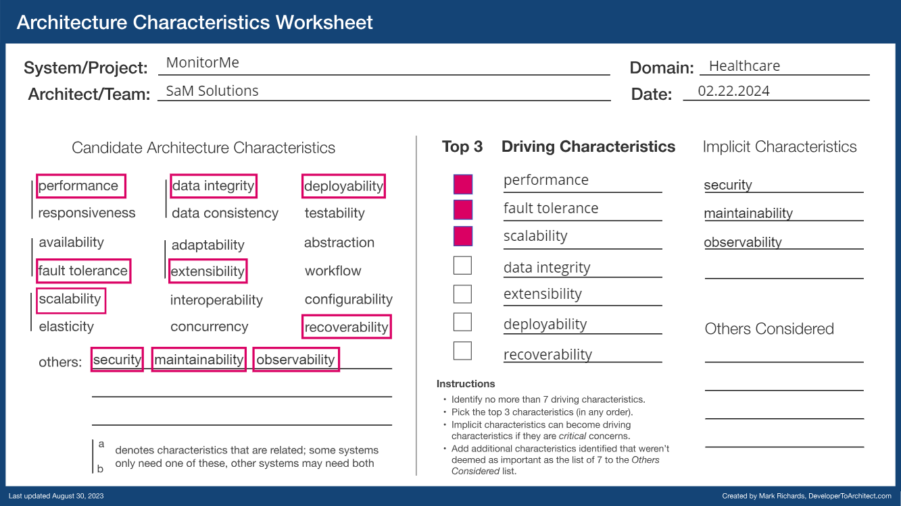

# Architecture Characteristics

After analysis of `MonitorMe` [requirements](../1.ProblemWalkthrough/2.Requirements.md) and key business drivers, we have identified the primary architectural characteristics that the system should incorporate. These key characteristics include Performance, Fault Tolerance and Elasticity.

---

[Back](./README.md)
