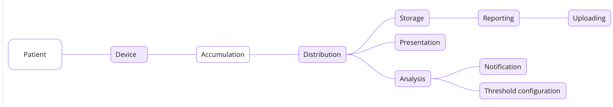

# Data Flow Diagram (DFD)

    Like a map of the stars, data flow diagrams reveal
    The paths of information through the systems we build
    They show us where the data comes, from and where it goes
    They speak a language clear and simple for all to see
    They are the guides and guardians of our system's harmony.

---

Before we jump into rather complicated topics, lets start by diving into the essence of the system being developed and understand how the data is planned to flow through it

### Patient

The most important actor in our system, oddly enough, will be the Patient, who will be the source of the data (vital signs) that will pass through the entire system (being stored, processed, analyzed, etc.).

### Device

The device will be a collector of information from the patient, which, being attached to the patient 24/7, will not only collect information but also send it to the system we are designing for further processing. If we talk about what a device is - it is a set of several autonomous sensors, each of which is an independent unit that can be replaced if necessary (you can draw an analogy between the sensors and the device with Thanos' glove and the infinity stones).

### Accumulation

Furthermore, once the data has been collected by a sensor attached to the device, it enters the accumulation logic, which is responsible for collecting this data into a specific package, consisting of data from all sensors for a specific patient per unit of time. 

Important note: The diagram shows that we do not save the raw data in any way, but in fact it would probably be worth saving it to perform some analysis on the "fresh data" later.

### Distribution

Once we have collected all the data into packages, they go to the distribution module, which is responsible for sending that packages to everyone who might need it (including storage, presentation and analysis modules). 

The technology for distributing this data can be represented as a publisher-subscriber pattern, where we have a distribution module and many subscribers to whom we need to send the data collected at this stage.

### Storage

Of course, the data we collect has to be stored somewhere. 

This will probably be a number of different stores, each of which will be responsible for one thing in particular, and will perform / be used for a specific action, whether it is just writing, or reading and writing.

### Presentation

Data from our packages needs to be displayed on the Monitor - this is where the Presentation module comes in, taking a ready-made data package and converting it into a user-friendly format.

Important note: The distribution module described in the paragraph above is responsible for ensuring that the package reaches a specific nurse station with a consolidated monitoring screen.

### Analysis

Once the package is received, the analysis module processes it using the thresholds module to identify alerts that should or should not be sent to the medical professionals

Analysis process includes comparing values with thresholds, as well as with median values of indicators in previous iterations (something like smart analysis, which would be worth implementing in addition to the basic thresholds values comparison).

### Reporting

Medical professionals can generate holistic snapshots / reports based on specific time periods. This data is retrieved from the Storage module and processed in the Reporting module, which, like the Presentation module, converts the data into an easy-to-view format that is unique holistic snapshots representation.

### Notification

Once we have processed the thresholds in the Analysis module, we make a decision - should we notify someone that something is going wrong? If so, then the data we have processed in the Analysis module goes straight to the Notification module, which is sends messages (alerts) according to the publisher-subscriber pattern.

### Threshold Configuration

This is a customisable module that includes setting thresholds to determine whether we should send a message to medical professionals or not. So far this module has no special features, but in the future it can be extended with the new rules, metrics, and perhaps something like an AI system setting these values that changes dynamically over time depending on sleep / awake Patient status.

### Uploading

Once the snapshot has been created, it can optionally be uploaded to the MyMedicalData SaaS product. This can be done through this module, which is largely a connector and does not have any special functionality beyond the regular upload.

## Last But not Least

As you can see, the system consists of many processes (dependent and independent) that perform the task in one or another way. These processes and their interactions can be viewed in the main diagram. This has only been a brief and general introduction to our system.

---

[Back](./README.md)