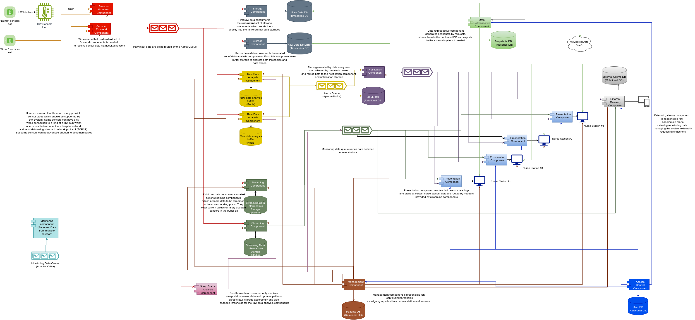

# MonitorMe System Diagram

    System diagrams are the sketches of our dreams
    That show us how to turn our visions into reality
    They depict the structure and behavior of our schemes
    And guide us through the complexity and variability.

---

---

[Back](./README.md)